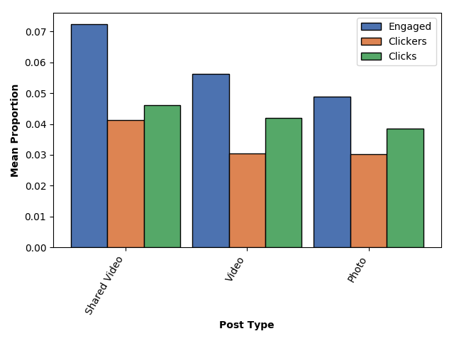

# **Generating Insight Using Facebook Analytics**

## Jane Stout, Ph.D.

The following is an analysis of Facebook Analytics data on a year's worth of posts for Organization X. To protect the privacy of Organization X, I do not provide identifying output (e.g., post text; post URLs). Rather, this report serves as a template for the type of data that can be reported using [my code].

Data were culled in 180 day increments from Facebook Analytics export tool, resulting in analytics for the timeframe: Dec 2017 - Jan 2019. The Organization is particularly interested in activity during the winter months. As such, this report focuses on post activity between **Dec 2017 - April 2018**.

Table 1 depicts the variables analyzed for this report; variable labels and descriptions of the variables are included.

**Table 1. Variable Labels and Descriptions of Variables Analyzed in this Report**

| Variable Labels | Description                                                                                                                                                                                          |
|-----------------|------------------------------------------------------------------------------------------------------------------------------------------------------------------------------------------------------|
| total_reach     | The number of people who had Organization X Page's post enter their screen. (Unique Users) This was everyone during the post's lifetime, or the set dates that the post was scheduled to run. (Reach = People) |
| total_imp       | The number of times a piece of content was displayed, regardless of whether it is interacted with, during a time period (Impressions = number times an ad has been shown on a screen).                |
| org_reach       | Organic posts occur when someone sees a post through a friend sharing. it                                                                                                                             |
| org_imp         | The number of times people saw post activity related to Organization X's page directly from Organization X's Page, for the lifetime (total run) of the post.                                                             |
| paid_reach      | The estimated number of people who saw a specific piece of content at least once during the time period paid for. (Reach = People)                                                     |
| paid_imp        | The number of times people saw activity related to Organization X's page via a paid Facebook ad, for the lifetime (total run) of the ad.                                                                          |
| engaged         | Total number of people who engaged (interacted with, clicked on) the content.                                                                                                                        |
| clickers        | The number of people who clicked anywhere in the post, reached through the audience targeting set up with the post.                                                                        |
| clicks          | The number of clicks anywhere in the post. Clicks generating stories are included in "Other Clicks." (Stories = A story is an item that is displayed in your News Feed or News Ticker.)            |

I first observed the range of Reach and Impression data (first six variables in Table 1). As seen in boxplots displayed in Figure 1, the boxes were broader and extending higher on the y axis (more Counts) for Impression data compared to Reach data. There were also outliers for Reach and impression data (diamonds above the boxes), indicating some posts resulted in 500+ Reaches and 1500+ Impressions. Note also there were zero instances of Reach or Impressions during periods that were paid for.

**Figure 1. Spread of Data for Reach and Impressions**

Next, I looked at the number of people who engaged with posted content, number of people who clicked on posts, and the number of clicks during the timeframe of interest. As seen in Figure 2a, most activity ranged between ~ 5-15. For instance, as seen by the height of the first box from the left (blue box), the bulk of the data for the number of people who engaged with posts falls between 5 - 15 on the y axis (Counts). There were also some outliers, as seen by the diamonds above the boxes.

**Figure 2a. Spread of Data for Engagement, Clickers, and Clicks**

Figure 2b shows the **proportion** of engagement/clicks/clickers out of the total reach during the timeframe of interest. Here, we see a pattern similar to that of Figure 2a. In general, audiences were interacting with posts < .10 (or 10%) of the time they are displayed.

**Figure 2b. Spread of the Proportion of Engagement, Clickers, and Clicks out of the Total Reach**

I also wondered about the type of post that results in the most activity. As seen in Figure 3, shared videos result in the highest degreeo of engagement, clickers, and clicks, followed by video posts, followed by photos. Not that all types of posts resulted in, in average, <10% of people interacting with the post.

**Figure 3. Average Proportion of Engagement, Clickers, and Clicks out of the Total Reach by Post Type**

Finally, I generated code to display the top 10 posts in terms of engagement, clickers, and clicks. Characteristics of these posts are displayed in Table 2. Note that identifying URL and Text information is not presented here, but can be found using [my code].

**Table 2. Top 10 Posts for Engagement**

| Rank | Timestamp        | Proportion Engaged | Post Type | URL                          | Text              |
|------|------------------|--------------------|-----------|------------------------------|-------------------|
| 1    | 4/3/18 15:08:06  | 0.18           | Link      | https://www.facebook.com/... | Text in post here |
| 2    | 1/29/18 10:55:15 | 0.08           | Photo     | https://www.facebook.com/... | Text in post here |
| 3    | 3/2/18 10:00:01  | 0.08           | Photo     | https://www.facebook.com/... | Text in post here |
| 4    | 2/28/18 12:14:40 | 0.07           | Video     | https://www.facebook.com/... | Text in post here |
| 5    | 2/8/18 7:00:00   | 0.07           | Photo     | https://www.facebook.com/... | Text in post here |
| 6    | 4/25/18 13:53:48 | 0.07           | Video     | https://www.facebook.com/... | Text in post here |
| 7    | 1/22/18 13:09:04 | 0.07           | Link      | https://www.facebook.com/... | Text in post here |
| 8    | 3/12/18 13:17:42 | 0.06           | Photo     | https://www.facebook.com/... | Text in post here |
| 9    | 4/27/18 12:52:37 | 0.06           | Photo     | https://www.facebook.com/... | Text in post here |
| 10   | 2/12/18 7:00:00  | 0.06           | Photo     | https://www.facebook.com/... | Text in post here |

This report has served as a template for the types of analyses that can be run using exported Facebook analytics data. Please feel free to use [my code] in your own work with Facebook analytics!

[my code]:(posts.py)
